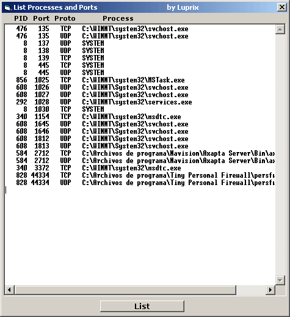



## List Processes and Ports with Native API

### Description

It lists all the Processes with open Ports using the Native API, not documented, NtQuerySystemInformation().

To know the processes with open ports we will access at the TDI level (Transport Driver Interface) helping us of the native functions located in the system library NTDLL.DLL.

This library is part of the system base of WINDOWS NT.

Attention: the use of undocumented functions implies risk that Microsoft modifies or eliminate them in a future.

At the moment it works perfectly in NT, W2K, XP and W2003.

In the same way that the Process Explorer application of Systernals (www.systernals.com), we will be able to enumerate all handles of all processes on execution in the system.

These handles (HANDLE) are not unique in the system, but yes in the process (PID). They don't have any relation with handles of window (HWND) that they are unique.

There are a group of unique handles by process, and they can be of different types:

files, pipes, mailslots, key's of the base of registry, ...

My code is a port of sources C++ to VB known in Internet (search Google).

Our programs use most times protected memory zones (User-Mode). (Do you remember memory page access violation?)

The controllers and drivers use real access to memory and hardware (Kernel-Mode). We need to transfer information located in Kernel-Mode to our application (User-Mode). One of the uses methods is making a call IOCTL to the driver using a buffer created by our application (Win32 function DeviceIoControl())

To synchronize the driver and the application we will use CreateEvent(). The named event i automatically created in the Object Manager's BaseNamedObjects directory.

Description of function:

It´s good Known that we need at least administrators rights to get access to all running processes.

Obtain execution privileges in the system by means of the function LoadPrivilege(), getting SeDebugPrivilege.

Then list all the processes (PID's) using NtQuerySystemInformation(), function of NTDLL.DLL, allowing us the access to the memory shared in Kernel-Mode.

Using NtQueryObject(), we will list all the hadles belonging to each process. To look for open ports we will filter the handles type "File" named "\device\tcp" and "\device\udp."

Then we look for information of each handle using NtDeviceIoControlFile(), that returns us the port like a integer number as the sockets API uses it. We convert that number through Swap of their Bytes using the IpHelper API function ntohs() and we convert it to a Long type of VB.

The rest is very easy: The function ProcessPathByPID lists the complete path of the requested PID.

This code is very useful in firewalls, netstat's and similar applications.

Other interesting use of the native API is to hide our program (process) in the TasksList by hook's.

That is on I am working at the moment, and I would upload it to PSC on depending of your votes :)

Excuse for my bad english. Greetings for all. Un saludo para todos.

Luprix

.
 
### More Info
 
Added Explanations

List Processes and Ports.

It lists all the Processes with open Ports using the Native API, not documented, NtQuerySystemInformation().

To know the processes with open ports we will access at the TDI level (Transport Driver Interface) helping us of the native functions located in the system library NTDLL.DLL.

This library is part of the system base of WINDOWS NT.

Attention: the use of undocumented functions implies risk that Microsoft modifies or eliminate them in a future.

At the moment it works perfectly in NT, W2K, XP and W2003.

In the same way that the Process Explorer application of Systernals (www.systernals.com), we will be able to enumerate all handles of all processes on execution in the system.

These handles (HANDLE) are not unique in the system, but yes in the process (PID). They don't have any relation with handles of window (HWND) that they are unique.

There are a group of unique handles by process, and they can be of different types:

files, pipes, mailslots, key's of the base of registry, ...

My code is a port of sources C++ to VB known in Internet (search Google).

Our programs use most times protected memory zones (User-Mode). (Do you remember memory page access violation?)

The controllers and drivers use real access to memory and hardware (Kernel-Mode). We need to transfer information located in Kernel-Mode to our application (User-Mode). One of the uses methods is making a call IOCTL to the driver using a buffer created by our application (Win32 function DeviceIoControl())

To synchronize the driver and the application we will use CreateEvent(). The named event i automatically created in the Object Manager's BaseNamedObjects directory.

Description of function:

It´s good Known that we need at least administrators rights to get access to all running processes.

Obtain execution privileges in the system by means of the function LoadPrivilege(), getting SeDebugPrivilege.

Then list all the processes (PID's) using NtQuerySystemInformation(), function of NTDLL.DLL, allowing us the access to the memory shared in Kernel-Mode.

Using NtQueryObject(), we will list all the hadles belonging to each process. To look for open ports we will filter the handles type "File" named "\device\tcp" and "\device\udp."

Then we look for information of each handle using NtDeviceIoControlFile(), that returns us the port like a integer number as the sockets API uses it. We convert that number through Swap of their Bytes using the IpHelper API function ntohs() and we convert it to a Long type of VB.

The rest is very easy: The function ProcessPathByPID lists the complete path of the requested PID.

This code is very useful in firewalls, netstat's and similar applications.

Other interesting use of the native API is to hide our program (process) in the TasksList by hook's.

That is on I am working at the moment, and I would upload it to PSC on depending of your votes :)

Excuse for my bad english. Greetings for all. Un saludo para todos.

Luprix

             |
---                |---
**Submitted On**   |2004-05-31 13:44:32
**By**             |[Luprix](https://github.com/Planet-Source-Code/PSCIndex/blob/master/ByAuthor/luprix.md)
**Level**          |Advanced
**User Rating**    |5.0 (348 globes from 70 users)
**Compatibility**  |VB 4\.0 \(32\-bit\), VB 5\.0, VB 6\.0, VB Script, ASP \(Active Server Pages\) , VBA MS Access, VBA MS Excel
**Category**       |[Windows API Call/ Explanation](https://github.com/Planet-Source-Code/PSCIndex/blob/master/ByCategory/windows-api-call-explanation__1-39.md)
**World**          |[Visual Basic](https://github.com/Planet-Source-Code/PSCIndex/blob/master/ByWorld/visual-basic.md)
**Archive File**   |[List\_Proce175233612004\.zip](https://github.com/Planet-Source-Code/luprix-list-processes-and-ports-with-native-api__1-54119/archive/master.zip)

